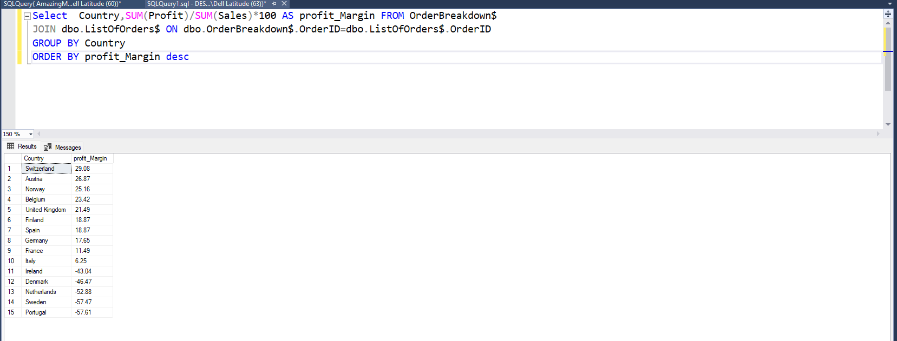
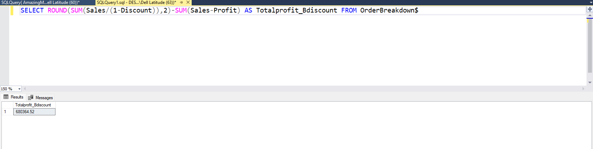

# Data Validation Using SQL Queries for AmazingMart Data

# Introduction

This project aims to analyze the sales trends of AmaingMart Superstore to improve their business growth using data-driven insights generated from the data.

Type of dataset-Sales Dataset

Problem Statement- Write SQL queries to generate insights that can be useful in  understanding the inconsistency in business growth patterns over the period of years included in the dataset.
 
Data Validation- Testing the results generated from Power BI and validating this using  SQL queries 

Data Structure- Two tables are included in the dataset named "List of Orders" and " Orders Breakdown".

- Table 1: List Of Orders
  

# Analysing Pipelines using SQL queries 

Data source- Sharepoint

Data cleaning- Data transformation was carried out in Power BI to check for incomplete data and missing values.

Import-Dataset was imported into SSMS as an Excel workbook using the Microsoft Access database 2016 Redistributable to gain access.

# Analysis 

Data Validation: Click the link for Power BI visualization [live visualization](https://app.powerbi.com/groups/me/reports/b5d02386-ee1f-4e0d-9377-2dde1ee5a59b/ReportSectioneb36539ae679103d20f1?experience=power-bi)

SQL Software- Studio Server Management System.

 
 # A. Key Performance Indicators 

 ### 1. Total Orders

SELECT COUNT (OrderID) AS TotalOrder FROM dbo.OrderBreakdown$

#### Result :

### 2. Total Cost price

SELECT SUM(Sales-Profit) AS TotalCostprice FROM OrderBreakdown$

#### Result :

### 3. Total Sales

SELECT SUM(Sales) AS Totalsales FROM OrderBreakdown$

#### Result :

### 4. Total Profit

SELECT SUM(Profit)  AS Totalprofit FROM OrderBreakdown$

#### Result :

### 5. Company Profit Margin

Select SUM(Profit)/SUM(Sales)*100 AS profit_Margin FROM OrderBreakdown$

#### Result :

# B. Yearly Performance

 ### 6. Company Yearly Sales

SELECT YEAR(Date) AS Year,SUM(Sales) AS Totalsales FROM OrderBreakdown$
JOIN dbo.ListOfOrders$ ON dbo.ListOfOrders$.OrderID=OrderBreakdown$.OrderID
GROUP BY YEAR(Date)
ORDER BY YEAR(Date)

#### Result :

 ### 7. Company Yearly Profit

SELECT YEAR(Date) AS Year,SUM(Profit) AS Totalprofit FROM OrderBreakdown$
JOIN dbo.ListOfOrders$ ON dbo.ListOfOrders$.OrderID=OrderBreakdown$.OrderID
GROUP BY YEAR(Date)
ORDER BY YEAR(Date)

### Result :

 

 # C. Product Category

 ### 8. Total Quantity Sold

SELECT SUM(Quantity) AS TotalquantitySold FROM OrderBreakdown$

#### Result :

### 9. Total QuantitySold by Category

SELECT Category, SUM(Quantity) AS Totalquantity FROM OrderBreakdown$
GROUP BY Category

#### Result :

### 10. Product Category by Year, Total Sales, and Total Profit

SELECT Category, YEAR(Date) AS Year,SUM(Sales) AS Totalsales,SUM(Profit) AS Totalprofit FROM OrderBreakdown$
JOIN dbo.ListOfOrders$ ON dbo.ListOfOrders$.OrderID=OrderBreakdown$.OrderID
GROUP BY YEAR(Date),Category
ORDER BY YEAR(Date)

#### Result :

# D. Country Analysis

### 11. Country Profit  Margin

Select  Country,SUM(Profit)/SUM(Sales)*100 AS profit_Margin FROM OrderBreakdown$
JOIN dbo.ListOfOrders$ ON dbo.OrderBreakdown$.OrderID=dbo.ListOfOrders$.OrderID
GROUP BY Country
ORDER BY profit_Margin desc

#### Result :

### 12. Country by Quantity Sold and Profit

SELECT  Country,SUM(Quantity) AS Totalquantitysold,SUM(Profit) AS Totalproffit FROM OrderBreakdown$
JOIN dbo.ListOfOrders$ ON dbo.OrderBreakdown$.OrderID=dbo.ListOfOrders$.OrderID
GROUP BY Country
ORDER BY Totalprofit DESC

### Result :

### 13. Top Five Countries

SELECT TOP(5) Country AS Top_5countries, SUM(Profit) AS Total profit FROM ListOfOrders$
JOIN dbo.OrderBreakdown$ ON dbo.OrderBreakdown$.OrderID= dbo.ListOfOrders$.OrderID
GROUP BY Country
ORDER BY Totalprofit desc

### Result :

### 14. Total Sales by Country

SELECT Country,SUM(Sales) AS TotalSales FROM ListOfOrders$
JOIN dbo.OrderBreakdown$ ON dbo.OrderBreakdown$.OrderID= dbo.ListOfOrders$.OrderID
GROUP BY Country
ORDER BY TotalSales desc

### Result :

# E. Company Sales Analysis and Discount

### 15. Discount by Profit

SELECT Discount AS Discount,SUM(Profit) AS TotalProfit FROM OrderBreakdown$
GROUP BY Discount
ORDER BY Discount desc

### Result :

### 16.  Total Sales Without Discount

SELECT ROUND(SUM(Sales/(1-Discount)),2) AS Totalsales_Bdiscount FROM OrderBreakdown$

### Result :

### 17. Total Profit Without Discount

SELECT ROUND(SUM(Sales/(1-Discount)),2)-SUM(Sales-Profit) AS Totalprofit_Bdiscount FROM OrderBreakdown$

### Result :

### 18. Total Profit when the discount is less than 30%

SELECT SUM(Profit) AS Total profit FROM OrderBreakdown$
WHERE Discount between 0 and 0.3

### Result :

### 19.  Total Profit when the discount is greater than 30%

SELECT SUM(Profit) AS Total profit FROM OrderBreakdown$
WHERE Discount between 0.3 and 1

### Result :

### 20. Average number of days by Ship mode

SELECT 
    ShipMode,
    AVG(DATEDIFF(day, Date, ShipDate)) AS AvgDeliveryTime 
FROM ListOfOrders$
GROUP BY ShipMode

### Result :

# Thank you for reading

    

   

